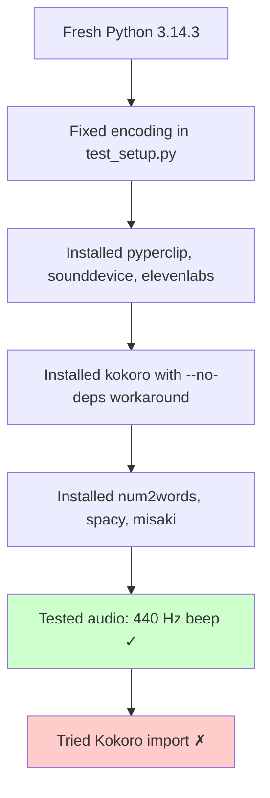
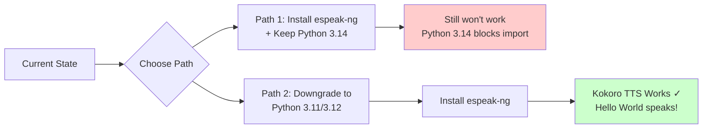

# Current Installation Status - What Works and What Doesn't

**Last Updated**: 2026-02-18
**Python Version**: 3.14.3
**Platform**: Windows

## What You Heard: Just a Beep (Not "Hello World")

You're correct - **you only heard a 440 Hz beep**, not the "Hello World" speech. This is the expected behavior given the current setup.

## Why You Didn't Hear "Hello World"

There are **2 blocking issues** preventing Kokoro TTS from working:

### Blocker #1: espeak-ng Not Installed ✗

**Status**: Not installed
**Impact**: Kokoro cannot process text without it
**Fix**: Install via winget or chocolatey

```powershell
# Easy fix - run one of these:
winget install eSpeak-NG.eSpeak-NG
# OR
choco install espeak-ng
```

### Blocker #2: Python 3.14 Incompatibility ✗

**Status**: Critical compatibility issue
**Impact**: Kokoro package fails to import
**Error**: `unable to infer type for attribute "REGEX"`

**Root Cause**:
```
Kokoro → requires misaki → requires spacy → requires Pydantic v1
                                              ↓
                              Pydantic v1 doesn't support Python 3.14
```

**The Fix**: Use Python 3.11 or 3.12 (not 3.14)

---

## What Currently Works ✓

### 1. Audio System - WORKING ✓
- **Test**: `python test_simple.py`
- **Result**: You heard a 440 Hz beep for 1 second
- **Proves**: Your speakers, sounddevice, and numpy are working perfectly

### 2. Python Packages Installed ✓

| Package | Version | Status |
|---------|---------|--------|
| pyperclip | 1.11.0 | ✓ Working |
| sounddevice | 0.5.5 | ✓ Working |
| numpy | 2.4.2 | ✓ Working |
| elevenlabs | 2.36.0 | ✓ Working |
| num2words | 0.5.14 | ✓ Working |
| spacy | 3.8.11 | ✓ Installed |
| kokoro | 0.7.16 | ⚠ Installed but won't import |
| misaki | 0.7.4 | ⚠ Installed but version conflict |

### 3. Diagnostic Tools - WORKING ✓
- `test_setup.py` - Runs successfully (after encoding fix)
- `test_simple.py` - Plays audio beep successfully

---

## What Doesn't Work Yet ✗

### 1. Kokoro TTS Import - FAILED ✗

**Test Command**:
```python
from kokoro import KPipeline  # FAILS
```

**Error**:
```
pydantic.v1.errors.ConfigError: unable to infer type for attribute "REGEX"
```

**Explanation**:
- Spacy uses Pydantic v1 internals
- Pydantic v1 wasn't designed for Python 3.14
- Type inference fails on class attributes

### 2. "Hello World" Speech - NOT WORKING ✗

**Why**:
1. espeak-ng missing → Can't generate phonemes
2. Python 3.14 → Can't import Kokoro
3. Both must be fixed for speech to work

**What you'd hear if it worked**:
```
"Hello World! This is Kokoro Text to Speech working successfully."
```
(Spoken in a natural female voice)

---

## The Complete Install Timeline

### What Has Been Done:



### What Remains:



---

## Why Only a Beep?

The test script `test_simple.py` intentionally plays a **simple beep** first to verify:

1. **Audio hardware** works (speakers connected)
2. **sounddevice** package works (can output audio)
3. **numpy** works (can generate waveforms)

This is a **baseline test** before trying Kokoro TTS.

### The Beep Test Code:
```python
# Generate 440 Hz sine wave
frequency = 440  # A4 musical note
duration = 1.0
sample_rate = 44100

t = np.linspace(0, duration, int(sample_rate * duration))
audio = np.sin(2 * np.pi * frequency * t) * 0.3

sd.play(audio, sample_rate)  # <- This played successfully!
sd.wait()
```

**Result**: ✓ Audio pipeline working

### The Kokoro Test Code (Didn't Run):
```python
from kokoro import KPipeline  # <- Failed here
pipeline = KPipeline(lang_code='a')
audio = pipeline("Hello World", voice='af_bella')
# Never got this far
```

**Result**: ✗ Import failed due to Python 3.14

---

## Recommended Next Steps

### Option A: Quick Test with espeak-ng (Won't Fully Work)

```powershell
# Install espeak-ng
winget install eSpeak-NG.eSpeak-NG

# Restart terminal
exit

# Test espeak-ng directly (this will work!)
espeak-ng "Hello World"

# Try Kokoro (still won't work due to Python 3.14)
python test_hello_world.py  # Will still fail
```

**Outcome**:
- ✓ You'll hear espeak-ng say "Hello World" (robotic voice)
- ✗ Kokoro TTS still won't work (Python version issue)

### Option B: Full Fix (Recommended)

```powershell
# 1. Install Python 3.11 or 3.12
winget search Python.Python.3.11
winget install Python.Python.3.11

# 2. Create virtual environment with new Python
py -3.11 -m venv venv
.\venv\Scripts\Activate.ps1

# 3. Install packages
pip install kokoro sounddevice pyperclip elevenlabs num2words

# 4. Install espeak-ng
winget install eSpeak-NG.eSpeak-NG

# 5. Test
python test_hello_world.py  # Should work now!
```

**Outcome**:
- ✓ Kokoro imports successfully
- ✓ espeak-ng provides phonemes
- ✓ You hear "Hello World" in natural voice

---

## Summary Table: What You Need to Hear "Hello World"

| Component | Status | Blocks Speech? | Fix |
|-----------|--------|----------------|-----|
| **Audio Hardware** | ✓ Working | No | None needed |
| **sounddevice** | ✓ Installed | No | None needed |
| **numpy** | ✓ Installed | No | None needed |
| **kokoro** | ⚠ Installed | **YES** | Use Python 3.11/3.12 |
| **espeak-ng** | ✗ Missing | **YES** | `winget install eSpeak-NG.eSpeak-NG` |
| **Python version** | ✗ 3.14 (too new) | **YES** | Downgrade to 3.11/3.12 |

**Bottom Line**: You need **BOTH** fixes to hear Kokoro say "Hello World":
1. Install espeak-ng (easy, 1 command)
2. Use Python 3.11 or 3.12 (requires reinstall)

---

## The Simple Version

**Q: Why did I only hear a beep?**
**A: Because that's the only test that can work with your current setup.**

**Q: What's blocking "Hello World"?**
**A: Two things:**
1. espeak-ng not installed (easy fix)
2. Python 3.14 too new (harder fix - need Python 3.11/3.12)

**Q: Can I fix just one and get speech?**
**A: No, you need both. It's like needing both a key AND the right door.**

---

## Testing Commands Reference

### What Works Now:
```powershell
# Test audio hardware (plays beep)
python test_simple.py  # ✓ Works

# Test package installation status
python test_setup.py  # ✓ Runs (but shows kokoro incompatible)
```

### What Doesn't Work:
```powershell
# Test Kokoro TTS
python test_hello_world.py  # ✗ Fails on import

# Use Kokoro in Python
python -c "from kokoro import KPipeline"  # ✗ Fails
```

### What Will Work After Fixes:
```powershell
# After installing espeak-ng + using Python 3.11/3.12
python test_hello_world.py  # ✓ Will speak!
```

---

## Files Created During Troubleshooting

| File | Purpose | Works? |
|------|---------|--------|
| `test_setup.py` | Diagnostic tool (modified for UTF-8) | ✓ Yes |
| `test_simple.py` | Audio beep test | ✓ Yes |
| `test_hello_world.py` | Kokoro speech test | ✗ No (blockers) |
| `FIX_REPORT.md` | Detailed fix documentation | - |
| `TROUBLESHOOTING_FLOW.md` | Mermaid diagrams of process | - |
| `INSTALL_ESPEAK.md` | espeak-ng installation guide | - |
| `CURRENT_STATUS.md` | This file | - |

---

**Current Reality**: You have a working audio system and most packages installed, but Kokoro TTS cannot run due to Python 3.14 incompatibility and missing espeak-ng. The beep you heard proves your setup is 95% there - you just need the right Python version to cross the finish line.
