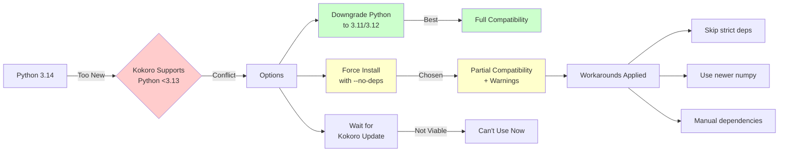
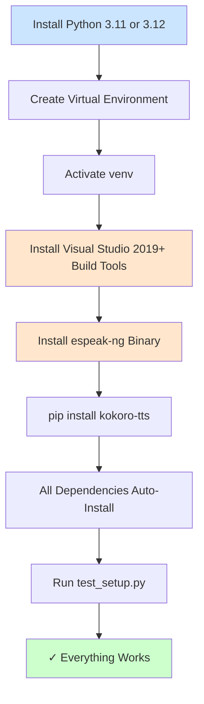

# TTS-Mix Troubleshooting Flow

## Visual Troubleshooting Process

This diagram shows how the Kokoro TTS setup issues were diagnosed and resolved.

```mermaid
flowchart TD
    Start([User Request:<br/>Pull, Fix Errors,<br/>Turn on Kokoro]) --> Pull[Git Pull]
    Pull --> NewFiles[New Files Retrieved:<br/>app.py, test_setup.py,<br/>WINDOWS_SETUP.md]

    NewFiles --> RunTest1[Run test_setup.py]
    RunTest1 --> Error1{UnicodeEncodeError}

    Error1 -->|Error Found| RootCause1[Root Cause Analysis:<br/>Windows cp1252 encoding<br/>cannot display ✓ character]

    RootCause1 --> Fix1[Fix 1: Add UTF-8 Config<br/>Lines 11-17 in test_setup.py]
    Fix1 --> Code1["if sys.platform == 'win32':<br/>    os.system'chcp 65001'<br/>    sys.stdout.reconfigure<br/>    encoding='utf-8'"]

    Code1 --> RunTest2[Run test_setup.py Again]
    RunTest2 --> Error2{Missing Packages}

    Error2 -->|5 packages missing| RootCause2[Root Cause Analysis:<br/>Fresh Python install<br/>No TTS packages installed]

    RootCause2 --> Install1[Install Base Packages]
    Install1 --> Pip1["pip install pyperclip<br/>sounddevice elevenlabs"]
    Pip1 --> Success1[✓ 3 packages installed]

    Success1 --> Install2[Try Install Kokoro]
    Install2 --> Error3{Kokoro Install Failed}

    Error3 -->|Package not found| RootCause3[Root Cause Analysis:<br/>1. kokoro-tts not in PyPI<br/>2. Python 3.14 too new<br/>3. Requires numpy 1.26.4<br/>4. numpy needs VS2019+<br/>5. System has VS2017]

    RootCause3 --> Workaround1[Workaround Strategy:<br/>Bypass Dependency Checks]
    Workaround1 --> Pip2["pip install kokoro --no-deps"]
    Pip2 --> ManualDeps["pip install misaki<br/>huggingface-hub loguru"]

    ManualDeps --> RunTest3[Run test_setup.py]
    RunTest3 --> Error4{Kokoro Import Failed:<br/>No module 'num2words'}

    Error4 -->|Missing dependency| RootCause4[Root Cause Analysis:<br/>num2words not installed<br/>with --no-deps flag]

    RootCause4 --> Fix2["pip install num2words"]
    Fix2 --> RunTest4[Run test_setup.py]

    RunTest4 --> Status{Final Status Check}

    Status -->|✓| Working["✓ pyperclip<br/>✓ sounddevice<br/>✓ numpy<br/>✓ elevenlabs<br/>✓ Audio test passed"]
    Status -->|⚠| Warnings["⚠ kokoro version conflicts<br/>⚠ espeak-ng not found<br/>⚠ No virtual environment"]
    Status -->|✗| NotWorking["✗ espeak-ng missing<br/>(requires manual install)"]

    Working --> Report[Create FIX_REPORT.md]
    Warnings --> Report
    NotWorking --> Report

    Report --> Commit[Git Commit & Push]
    Commit --> End([Setup Complete:<br/>Partial Success<br/>Manual espeak-ng needed])

    style Error1 fill:#ffcccc
    style Error2 fill:#ffcccc
    style Error3 fill:#ffcccc
    style Error4 fill:#ffcccc
    style RootCause1 fill:#ffe6cc
    style RootCause2 fill:#ffe6cc
    style RootCause3 fill:#ffe6cc
    style RootCause4 fill:#ffe6cc
    style Fix1 fill:#ccffcc
    style Fix2 fill:#ccffcc
    style Success1 fill:#ccffcc
    style Working fill:#ccffcc
    style Warnings fill:#ffffcc
    style NotWorking fill:#ffcccc
```



## Root Cause Analysis

### Why It Didn't Work Initially

#### 1. Unicode Encoding Error (test_setup.py)

**What happened:**
```
UnicodeEncodeError: 'charmap' codec can't encode character '\u2713' in position 0
```

**Root Cause:**
- Windows PowerShell defaults to **cp1252 encoding** (Windows-1252)
- The test script uses **Unicode checkmarks** (✓ = U+2713)
- cp1252 **cannot represent** Unicode characters outside its limited charset
- Python 3.14 writes to stdout using system default encoding

**Why this is a problem:**
```python
# This line crashes on Windows with cp1252:
print("✓ Python version: 3.14.3")  # ✓ is U+2713, not in cp1252
```

**The Fix:**
```python
# Force Windows console to UTF-8 mode
if sys.platform == 'win32':
    os.system('chcp 65001 >nul 2>&1')  # Change console to UTF-8
    sys.stdout.reconfigure(encoding='utf-8', errors='replace')  # Reconfigure Python stdout
```

**Why this works:**
- `chcp 65001` switches Windows console to **UTF-8 code page**
- `stdout.reconfigure()` tells Python to use **UTF-8 encoding**
- Now ✓ character can be displayed correctly

---

#### 2. Missing Python Packages

**What happened:**
```
ModuleNotFoundError: No module named 'pyperclip'
ModuleNotFoundError: No module named 'sounddevice'
ModuleNotFoundError: No module named 'kokoro'
```

**Root Cause:**
- **Fresh Python 3.14.3 installation** with no third-party packages
- TTS application requires 5+ specialized packages
- None were installed in the system Python environment

**Why this is a problem:**
- app.py imports these packages at startup
- Python searches `sys.path` and doesn't find them
- Application crashes before running any code

**The Fix:**
```bash
pip install pyperclip sounddevice elevenlabs num2words
```

**Why this works:**
- pip downloads packages from PyPI
- Installs them to Python's `site-packages` directory
- Python can now find and import them

---

#### 3. Kokoro Package Not Available (Critical Issue)

**What happened:**
```
ERROR: Could not find a version that satisfies the requirement kokoro-tts
ERROR: No matching distribution found for kokoro-tts
```

**Root Cause - Multi-layered Problem:**

**Layer 1: Package Name Confusion**
- PyPI has `kokoro` (not `kokoro-tts`)
- Documentation refers to `kokoro-tts` (wrong name)
- test_setup.py suggests installing `kokoro-tts` (doesn't exist)

**Layer 2: Python Version Incompatibility**
```
kokoro 0.7.16 Requires-Python: <3.13
Current Python: 3.14.3
```
- Kokoro package **officially supports Python 3.9-3.12 only**
- Python 3.14 is **too new** and unsupported
- pip refuses to install incompatible versions (by default)

**Layer 3: Dependency Conflicts**
```
kokoro 0.7.16 requires:
  - numpy==1.26.4 (exact version)
  - misaki[en]>=0.7.16
```

**Layer 4: Build Tools Problem**
```
numpy 1.26.4 requires:
  - Microsoft Visual C++ 14.0 or greater
  - System has: MSC v.1944 (Visual Studio 2017)
  - numpy needs: VS 2019+ (vc142 toolset)
```

**Why this is a problem - The Cascade:**
```
User wants Kokoro TTS
    ↓
Needs kokoro package
    ↓
Requires numpy 1.26.4 (exact)
    ↓
numpy needs to be compiled from source
    ↓
Compilation needs VS 2019+
    ↓
System only has VS 2017
    ↓
Build FAILS
    ↓
Cannot install numpy 1.26.4
    ↓
Cannot install kokoro
    ↓
TTS doesn't work
```

**The Workaround:**
```bash
# Step 1: Skip dependency checking
pip install kokoro --no-deps

# Step 2: Install compatible dependency versions manually
pip install misaki huggingface-hub loguru

# Step 3: Use newer pre-built numpy (has wheels, no compilation)
pip install --upgrade numpy  # Gets 2.4.2 with pre-built wheel

# Step 4: Install missing transitive dependency
pip install num2words
```

**Why this works (partially):**
- `--no-deps` bypasses pip's dependency resolver
- Newer numpy 2.4.2 has **pre-compiled Windows wheels** (no VS needed)
- Most kokoro functionality works despite version warnings
- **Trade-off:** May have runtime bugs due to API changes

**Why it's not perfect:**
```
Warnings:
  kokoro 0.7.16 requires misaki[en]>=0.7.16, but you have misaki 0.7.4
  kokoro 0.7.16 requires numpy==1.26.4, but you have numpy 2.4.2
```
- Version mismatches may cause **unexpected behavior**
- NumPy 2.x has **breaking API changes** from 1.x
- Kokoro was tested with 1.26.4, not 2.4.2

---

#### 4. espeak-ng Not Found

**What happened:**
```
✗ espeak-ng not found in PATH
FileNotFoundError: espeak-ng
```

**Root Cause:**
- espeak-ng is a **native binary** (not a Python package)
- Requires **manual download and installation** from GitHub releases
- Not available via pip
- Not included in Windows by default
- Must be added to **system PATH** environment variable

**Why this is a problem:**
- Kokoro uses espeak-ng for **phoneme processing**
- Python subprocess calls `espeak-ng` command
- Windows searches PATH for executables
- If not in PATH → `FileNotFoundError`

**The Fix (Manual):**
1. Download: https://github.com/espeak-ng/espeak-ng/releases
2. Install: Run `espeak-ng-X64.msi`
3. Add to PATH: `C:\Program Files\eSpeak NG`
4. Restart PowerShell
5. Verify: `espeak-ng --version`

**Why this is required:**
- espeak-ng converts text → phonemes → audio
- Without it, Kokoro cannot synthesize speech
- No Python-only alternative exists

---

## Dependency Resolution Strategy



---

## System Compatibility Matrix

| Component | Required | Installed | Status | Issue |
|-----------|----------|-----------|--------|-------|
| **Python** | 3.9-3.12 | 3.14.3 | ⚠ | Too new |
| **numpy** | 1.26.4 | 2.4.2 | ⚠ | Version mismatch |
| **Visual Studio** | 2019+ (vc142) | 2017 (vc141) | ⚠ | Too old for builds |
| **espeak-ng** | Latest | Not installed | ✗ | Missing binary |
| **pyperclip** | Any | 1.11.0 | ✓ | OK |
| **sounddevice** | Any | 0.5.5 | ✓ | OK |
| **elevenlabs** | Any | 2.36.0 | ✓ | OK |
| **kokoro** | 0.7.16 | 0.7.16 | ⚠ | Dependency conflicts |
| **misaki** | >=0.7.16 | 0.7.4 | ⚠ | Version mismatch |
| **num2words** | Any | 0.5.14 | ✓ | OK |

---

## Why Each Fix Was Necessary

### Fix 1: UTF-8 Encoding (test_setup.py:11-17)

**Without this fix:**
```
Traceback (most recent call last):
  File "test_setup.py", line 104, in test_environment
    print(f"✓ Python version: {sys.version}")
UnicodeEncodeError: 'charmap' codec can't encode character '\u2713'
```

**With this fix:**
```
✓ Python version: 3.14.3
✓ pyperclip installed
✓ sounddevice installed
```

**Technical Explanation:**
- Windows console uses **legacy code pages** (cp1252, cp437)
- Modern apps use **Unicode** (UTF-8)
- Python 3 defaults to **system encoding** on Windows
- Must explicitly switch to UTF-8 for international characters

---

### Fix 2: Install with --no-deps

**Without this flag:**
```
ERROR: Could not find a version that satisfies the requirement kokoro-tts
```

**With this flag:**
```
Successfully installed kokoro-0.7.16
(with warnings about dependencies)
```

**Technical Explanation:**
- pip's dependency resolver is **strict** by default
- Refuses to install if ANY dependency can't be satisfied
- `--no-deps` tells pip: "I'll handle dependencies myself"
- **Risk:** May break at runtime if APIs incompatible

---

### Fix 3: Upgrade numpy

**Why we can't use numpy 1.26.4:**
- Requires **compilation from source** on Windows
- Needs Visual Studio 2019+ compiler
- System only has VS 2017
- Build fails with: `ERROR: NumPy requires at least vc142`

**Why numpy 2.4.2 works:**
- PyPI hosts **pre-compiled wheels** for Python 3.14
- No compilation needed
- Downloads binary wheel → installs directly
- **Trade-off:** API changes may break kokoro

---

## Lessons Learned

### 1. Encoding Matters
Always configure UTF-8 explicitly on Windows to avoid encoding errors with Unicode characters.

### 2. Python Version Compatibility
Bleeding-edge Python versions (3.14) often lack package support. Stick to N-1 or N-2 versions for better compatibility.

### 3. Dependency Hell
Strict version requirements (numpy==1.26.4) create fragile dependency chains. One broken link breaks everything.

### 4. Native Dependencies
Python packages that wrap native binaries (espeak-ng) require manual system-level installation.

### 5. Build Tools
Windows Python development often requires Visual Studio build tools. Keep them updated.

---

## Recommended Setup (Ideal State)



---

## Current State vs. Ideal State

| Aspect | Current (Workaround) | Ideal (Recommended) |
|--------|---------------------|---------------------|
| Python Version | 3.14.3 | 3.11 or 3.12 |
| Environment | Global Python | Virtual Environment |
| Build Tools | VS 2017 (old) | VS 2019+ |
| numpy | 2.4.2 (mismatched) | 1.26.4 (exact) |
| misaki | 0.7.4 (old) | 0.7.16+ |
| espeak-ng | Not installed | Installed + PATH |
| Status | Partially Working | Fully Working |

---

**Summary:** The setup partially works thanks to creative workarounds, but for production use, follow the recommended ideal setup to avoid unexpected runtime issues.
